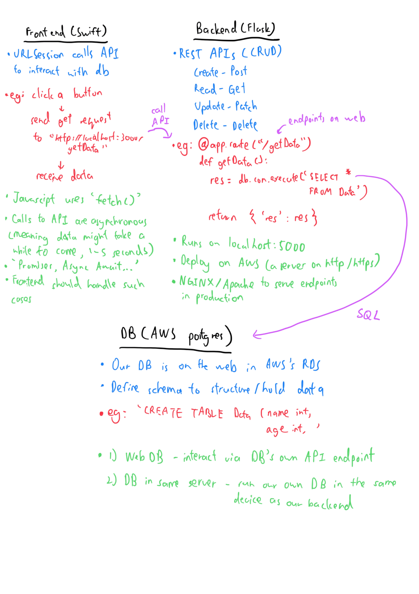

# bluehire-frontend

# Links
- **Figma** - https://www.figma.com/design/0cPBF7Tfkflib4gLk8n33q/iOS-24%2F25-Figma-Design-Board?node-id=94-80&t=25d8HzingcunsyLk-1
- **Backend** - https://github.com/michiganhackers/bluehire-backend
- **Documentation** - https://docs.google.com/document/d/1xmsIfHM3SBfpUo6uGEF5_gOhPBcxgC6W1ytqsXmZTo4/edit?usp=sharing

# Overview
- **Core/**
  - Follows the Model-ViewModel-View (MVVM) architecture
  - Model represents how data will be stored/processed
  - View uses SwiftUI to define our user interface
  - ViewModel contains the logic for our View to interact with our ViewModel
  - Componenets contains user interface that is used repeatedly
- **Services/**
  - Contains any code that interacts with the web (http/https) such as our personal or external APIs
- **Auth/**
  - Contains any code that deals with authentication

## CI/CD Workflow

### 1. Trello Task
- Create a Trello card with an appropriate title and assign it to yourself.
- For example, 'Homepage UI'

### 2. Pull Latest Code (git operations can be done in Xcode GUI alternatively)
- Switch to the `main` branch and pull the latest changes:
  ```bash
  git pull origin main

### 3. Create Feature Branch
- Create a feature branch in Xcode using the format: #[card number]-[title]:
  ```bash
  git checkout -b #11-HomePageUI

### 4. Sync with Main Branch and Develop
- Periodically pull the latest changes from main:
  ```bash
  git pull origin main

## Code style
### 1. Use camelCase for naming 
- For example,
  ```bash
  var myCustomButton: UIButton
  func fetchUserData()

### 2. Reusable Components
- For example, if Navbar is used across multiple pages, extract it in a separate file and use any existing one

## Workflow

